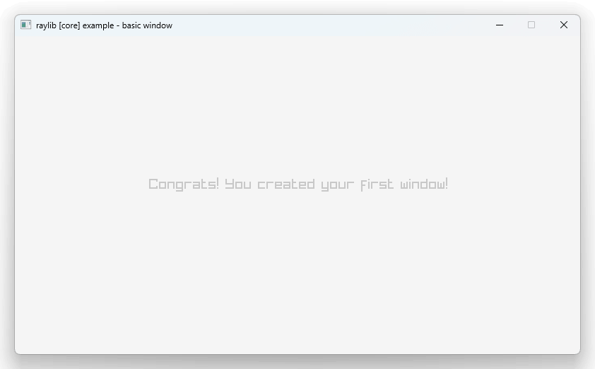

# jank raylib test



Using https://github.com/funatsufumiya/raylib-namespace-wrapper/ in order to prevent name conflict especially in windows.

```jank
(ns jank-raylib-test.main)

(cpp/raw "

#include <RaylibWrapper/c_api.h>

rlw::Color raywhite = {245, 245, 245, 255};
rlw::Color lightgray = { 200, 200, 200, 255 };

")

(defn -main [& args]
  (let [w 800
        h 450]
    (cpp/rlw_InitWindow w h "raylib [core] example - basic window")
    (cpp/rlw_SetTargetFPS 60)
    (while (cpp/! (cpp/rlw_WindowShouldClose))
           (do
             (cpp/rlw_BeginDrawing)
             (cpp/rlw_ClearBackground cpp/raywhite)
             (cpp/rlw_DrawText "Congrats! You created your first window!", 190, 200, 20, cpp/lightgray)
             (cpp/rlw_EndDrawing))) 
    (cpp/rlw_CloseWindow)))
```

Tested on Win/Mac/Linux (windows ver is checked using [jank-win](https://github.com/ikappaki/jank-win), mac/linux is used brew/apt, see [#installation](https://book.jank-lang.org/getting-started/01-installation.html))

## Run

```bash
$ lein run
```
